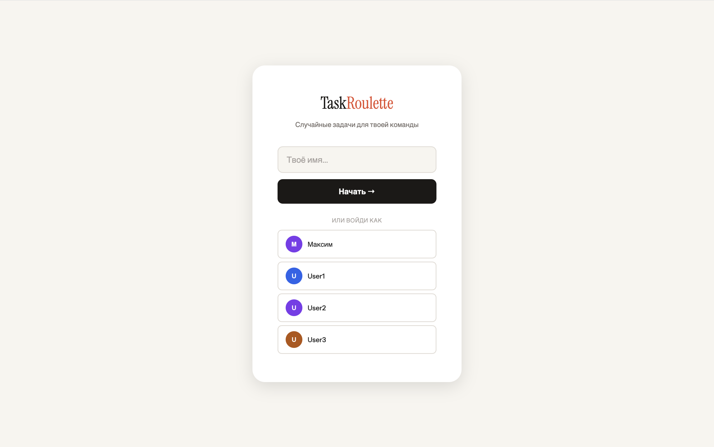
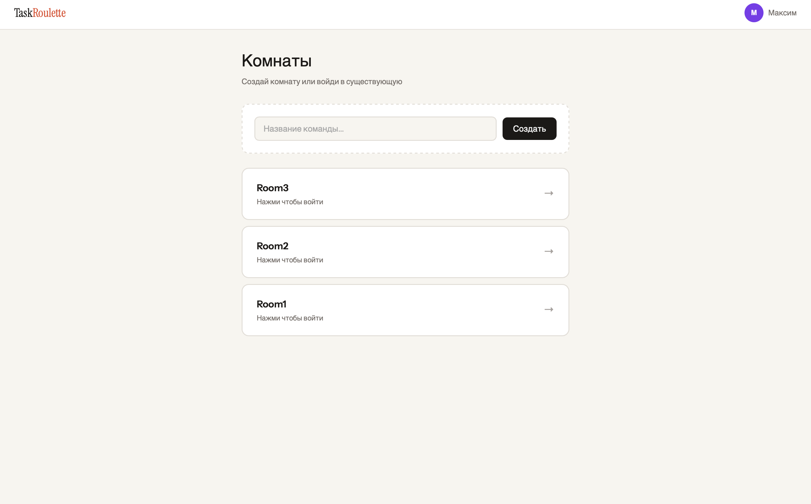
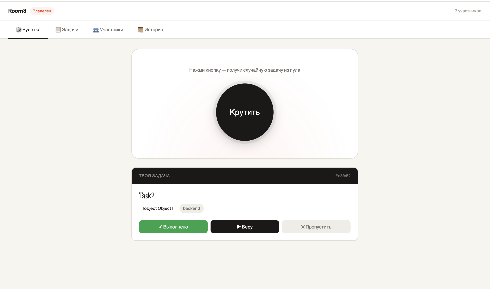
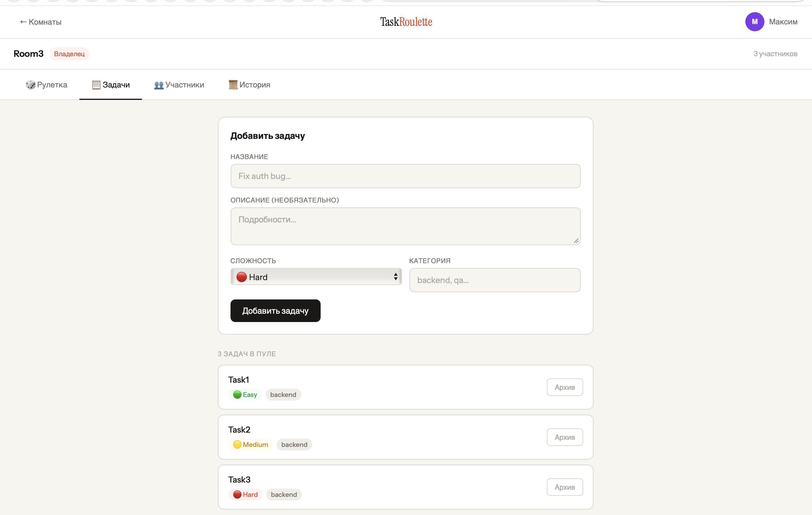
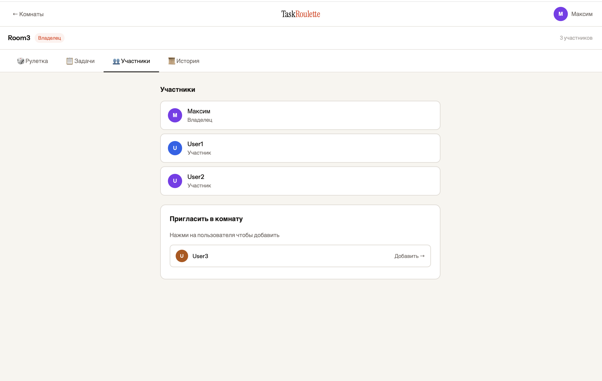
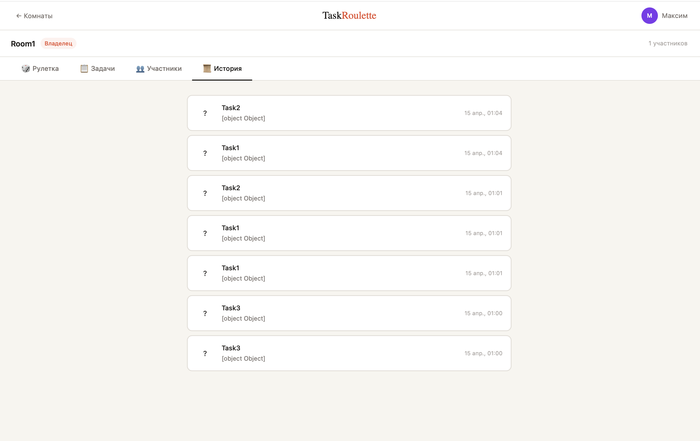

# 🎲 Task Roulette

Бэкенд-сервис для случайного распределения задач внутри команды. Участники комнаты крутят рулетку и получают случайную задачу из пула — отмечают выполнение, пропуск или берут в работу.

## Стек

- **Scala 3**
- **http4s** — HTTP-сервер
- **Cats Effect** — IO-рантайм
- **Circe** — JSON сериализация
- **PostgreSQL** — хранилище данных

---

## Запуск

```bash
# Поднять БД
docker-compose up -d

# Запустить сервер
sbt run
```

Сервер стартует на `http://localhost:8080`

---

## API

### Users

| Метод | Путь | Описание |
|-------|------|----------|
| `POST` | `/users` | Создать пользователя |
| `GET` | `/users` | Получить всех пользователей |
| `GET` | `/users/:id` | Получить пользователя по ID |

**POST /users**
```json
{ "name": "Алексей" }
```

---

### Rooms

| Метод | Путь | Описание |
|-------|------|----------|
| `POST` | `/rooms` | Создать комнату |
| `GET` | `/rooms/:id` | Получить комнату по ID |
| `GET` | `/rooms/:roomId/members` | Список участников |
| `POST` | `/rooms/:roomId/members` | Добавить участника |

**POST /rooms**
```json
{ "name": "Backend Team", "createdBy": "uuid" }
```

**POST /rooms/:roomId/members**
```json
{ "userId": "uuid", "requesterId": "uuid" }
```
> Добавить участника может только владелец комнаты.

---

### Tasks

| Метод | Путь | Описание |
|-------|------|----------|
| `POST` | `/tasks` | Создать задачу |
| `GET` | `/tasks/:id` | Получить задачу по ID |
| `GET` | `/rooms/:roomId/tasks` | Все задачи комнаты |
| `DELETE` | `/tasks/:id` | Архивировать задачу |

**POST /tasks**
```json
{
  "title": "Написать тесты",
  "description": "Покрыть сервисный слой",
  "difficulty": "medium",
  "category": "backend",
  "roomId": "uuid",
  "createdBy": "uuid"
}
```

Поле `difficulty`: `easy` | `medium` | `hard`

**DELETE /tasks/:id**
```json
{ "requesterId": "uuid" }
```
> Архивировать может только владелец комнаты.

---

### Roulette

| Метод | Путь | Описание |
|-------|------|----------|
| `GET` | `/rooms/:roomId/spin?userId=uuid` | Получить случайную задачу |

Возвращает случайную активную задачу из пула комнаты.

---

### Events

| Метод | Путь | Описание |
|-------|------|----------|
| `POST` | `/events` | Записать событие по задаче |
| `GET` | `/tasks/:taskId/events` | История по задаче |
| `GET` | `/users/:userId/events` | История по пользователю |
| `GET` | `/rooms/:roomId/events` | История по комнате |

**POST /events**
```json
{
  "taskId": "uuid",
  "userId": "uuid",
  "roomId": "uuid",
  "status": "completed",
  "comment": "Готово"
}
```

Поле `status`: `completed` | `skipped` | `in_progress`

---

## Модели

```
User        — id, name, createdAt
Room        — id, name, createdBy, createdAt
RoomMember  — roomId, userId, role (Owner | Member), joinedAt
Task        — id, title, description, difficulty, category, roomId, createdBy, createdAt, isActive
TaskEvent   — id, taskId, userId, roomId, status, comment, occurredAt
```

---

## Скриншоты

| Вход | Комнаты                           |
|------|-----------------------------------|
|  |  |

| Рулетка                              | Задачи                            |
|--------------------------------------|-----------------------------------|
|  |  |

| Участники                                | История |
|------------------------------------------|---------|
|  |  |